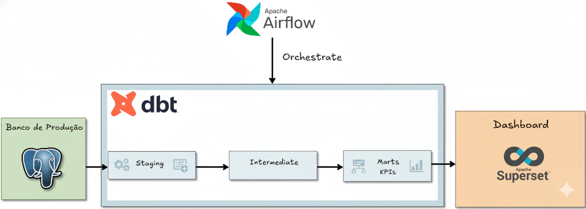

# 🧩 Projeto Data Warehouse com DBT, Airflow e Observabilidade (Elastic Stack)

## 🎯 Objetivo do Projeto

Criar uma **pipeline observável** onde há a **ingestão de dados** de um *database* para a criação de um **Data Warehouse** utilizando o **DBT (Data Build Tool)**.  
O projeto abrange desde o tratamento dos dados **RAW** até a criação das **tabelas Fato e Dimensão**, bem como dos **KPIs** que podem ser consumidos diretamente da camada **Marts**, disponibilizados em um **Dashboard no Apache Superset**, fornecendo *insights* sobre os dados do banco.

A orquestração é realizada pelo **Apache Airflow**, utilizando o **DBT DAG** fornecido pelo **Cosmos da Astronomer**, garantindo controle, versionamento e execução automatizada.  
Além disso, a **observabilidade** é implementada com **ElasticSearch + Kibana**, responsáveis por armazenar e visualizar os logs de execução do Airflow, permitindo o monitoramento em tempo real da performance das DAGs e transformações.

---

## 🏗️ Arquitetura do Projeto



O fluxo principal segue as seguintes etapas:

1. **Ingestão de Dados:** Coleta e carga de dados brutos (RAW) de uma base relacional.  
2. **Transformação (DBT):** Padronização e modelagem dos dados em camadas `staging`, `intermediate` e `marts`.  
3. **Orquestração (Airflow):** Execução automatizada e monitorada das etapas com o `DbtDag` do **Cosmos/Astronomer**.  
4. **Armazenamento e Observabilidade:** Logs de execução enviados ao **ElasticSearch**, visualizados no **Kibana**.  
5. **Visualização (Superset):** Dashboards e KPIs consumindo diretamente a camada **Marts**.

---

## 📊 Dashboard Feito no Superset


O dashboard apresenta métricas financeiras e operacionais derivadas das tabelas de fato e dimensão criadas no warehouse, permitindo análises de performance, margens, crescimento e comportamento de clientes.

---

## 📁 Estrutura do Projeto

A estrutura base é organizada da seguinte forma:

```
Warehouse_DBT/
├── airflow/
│   ├── dags/
│   │   └── dbt_dag.py
│   ├── include/
│   ├── plugins/
│   └── Dockerfile
│
├── dbt/
│   ├── warehouse_dbt/
│   │   ├── models/
│   │   │   ├── staging/
│   │   │   ├── intermediate/
│   │   │   └── marts/
│   │   ├── macros/
│   │   └── dbt_project.yml
│   └── logs/
│   
│
├── observability/
│   ├── docker-compose.yml
│   └── filebeat.yml
│
├── images/
│   ├── projeto_end_to_end_dbt_airflow.png
│   └── dashboard-financeiro.jpg
│
├── docker-compose.yml
└── README.md
```

---

## 🚀 Como Executar

### 🔧 Pré-requisitos

Certifique-se de ter instalado:

- [Docker](https://docs.docker.com/get-docker/)
- [Docker Compose](https://docs.docker.com/compose/)
- [Astronomer CLI (Astro)](https://www.astronomer.io/docs/astro/cli/overview)

---

### 1️⃣ Clone o repositório

```bash
git clone https://github.com/AngeloGagno/Warehouse_DBT
cd Warehouse_DBT
```

---

### 2️⃣ Verifique se o Docker está rodando corretamente

```bash
docker --version
docker compose version
```

---

### 3️⃣ Instale o Astro (Astronomer CLI)

#### Via pip:
```bash
pip install astro
```

#### Via brew (MacOS):
```bash
brew install astronomer/tap/astro
```

#### Verifique a instalação:
```bash
astro version
```

---

### 4️⃣ Inicie o ambiente Airflow

```bash
astro dev start
```

> Isso irá subir o ambiente do **Airflow** em [http://localhost:8080](http://localhost:8080)

---

### 5️⃣ Inicie o container de Observabilidade

```bash
cd ./observability
docker compose up -d
```

> Isso irá subir o **Kibana** em [http://localhost:5601](http://localhost:5601)

---

## 🔐 Variáveis e Credenciais Necessárias

As credenciais são configuradas diretamente no **Airflow UI** como **Connections**, incluindo:

- **Postgres Connection** (para o database de origem e warehouse)

---

## 📚 Referências

- [Astronomer CLI](https://www.astronomer.io/docs/astro/cli/overview)  
- [Apache Airflow](https://airflow.apache.org/docs/)  
- [DBT Core](https://docs.getdbt.com/docs/introduction)  
- [Elastic Stack](https://www.elastic.co/what-is/elk-stack)  

---

## 👤 Contato

**Autor:** Angelo Gagno  
📧 [angelogagno@gmail.com](mailto:angelogagno@gmail.com)  
💼 [linkedin.com/in/angelogagno](https://linkedin.com/in/angelogagno)  
🐙 [github.com/AngeloGagno](https://github.com/AngeloGagno)

